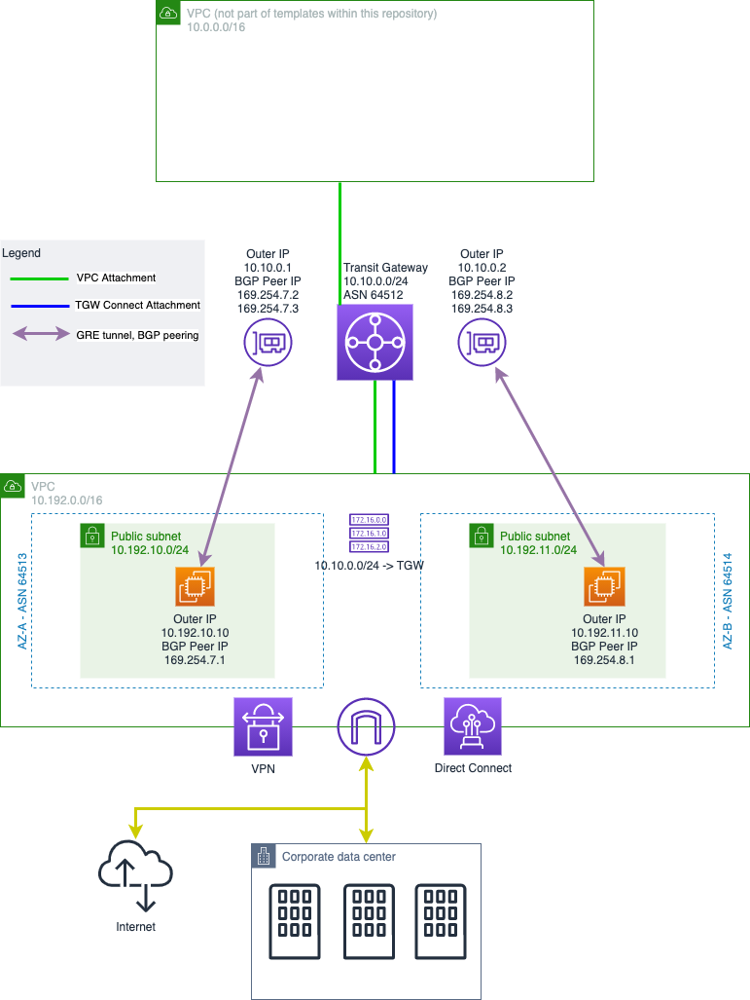

# AWS Transit Gateway Connect Sample

## Welcome

This repository demonstrates the usage of Transit Gateway (TGW) connect and accelerates your integration of SDWAN appliances with AWS Transit Gateway.

For more details, checkout the [Documentation](https://docs.aws.amazon.com/vpc/latest/tgw/tgw-connect.html) and our [Blog Article](https://aws.amazon.com/de/blogs/networking-and-content-delivery/simplify-sd-wan-connectivity-with-aws-transit-gateway-connect/).

## Pre-requisites

Example ip ranges see architecture diagram and pre-requisites folder in this repository

* Transit Gateway setup with unused CIDR attached
* VPC with two public subnets
* VPC attached to Transit Gateway
* Public subnets route table entries with destination TGW CIDR pointing to TGW

## Deployment
1. (Optional) Deploy [tgw_vpc_basics.yaml](./pre-requisites/tgw_vpc_basics.yaml) for VPC and Transit Gateway setup
2. Important: Manually attach a CIDR block to Transit Gateway (here: `10.10.0.0/24`)
3. Deploy [gre_setup.yaml](gre_setup.yaml), important parameters are the transport TGW attachment id, route table id and VPC information

## Deployment Consumer VPCs
1. VPC needs to be attached to TGW
2. Consumer subnets need a default route (`0.0.0.0/0`) towards TGW
3. VPC attachment has to be associated with GRE main route table
4. Routing from TGW towards consumer VPC has to be in place within GRE main route table 

## Architecture

## Data Points
* Dual redundant setup, two SDWAN instances with two GRE tunnels each
* Full appliance instance failover takes ~30s

## Limitations
* Not all regions support TGW Connect (details see AWS documentation: [TGW Connect](https://docs.aws.amazon.com/vpc/latest/tgw/tgw-connect.html))
* CFN resource type `AWS::EC2::TransitGatewayConnect` is not supported in all regions

### Note:

* **While code samples in this repository has been tested and believe it works well, as always, be sure to test it in your environment before using it in production!**
* **The sample SDWAN appliances are just break-outs to the public internet in this sample setup**

## Security

See [CONTRIBUTING](CONTRIBUTING.md#security-issue-notifications) for more information.

## License

This library is licensed under the MIT-0 License. See the [LICENSE](LICENSE) file.